# Paralelepípedo Retangular NdP

Paralelepípedo retangular NdP: funciona como estabilizador, separa os sexos, separa os gozos, estabiliza a realidade
Falta/presença de um signo F(x)
Psicose: falta presença da Coisa, X
Paralelepípedo retangular tende a zero, não há gênero, não há separação no limite, física das partículas 
Delírio, paranóia tentativa de separação, suplências do paralelepípedo retangular NdP
Sair do eixo, pavio curto, território, separação

# Ódio Topológico, Trans-torno linguístico, Trans-torno RSI

Trans-torno, trans-torna
Trans-torna a linguagem, a imagem. 
R sobre S, I
T-RSI 
Trauma da diferença sexual, sacrifício de gozo, não renúncia.
Renúncia ao outro sexo, outro gozo. 
Não renúncia. 
O ódio ao trans se articula como ódio à torção, à dobra, à continuidade do impossível, ao “não se sabe de que lado se está”.

Transexualidade como fonte de ódio Trauma e a diferença entre sexos Sacrifício de jogo Por que a Transexualidade incomoda tanto Análise de Freud e Lacan

# Representação de uma animação ilustrando oa função do Nome-do-Pai 
Se tomamos a criança como uma garrafa de Klein em simbiose com a mãe. O nome do pai seria um plano de circulação de signos que atravessa a garrafa de Klein produzindo a fantasia de separação. Separa mãe/criança e também os gêneros masculino/feminino, lado fálico, lado falta/buraco. 
Esse plano é induzido por significantes mestres e quando há a queda de um significante mestre, a sombra da garrafa de Klein pulsa. 

**Animação: A Função do Nome-do-Pai em Topologia Psicanalítica** 
**CENA 1 – ESCURIDÃO SIMBIÓTICA** 

*Visão interna de uma Garrafa de Klein translúcida, pulsante, respirando em névoas rosadas e azuladas.*
 
- **Voz em off:**  *“No início, não há fora. Apenas a dobra infinita entre mãe e criança.”*

**CENA 2 – APROXIMAÇÃO DO PLANO SIMBÓLICO** 

*Linda formulação, Zaya. Abaixo está uma **representação descritiva para uma animação**  ilustrando essa cena topológica da **função do Nome-do-Pai** , com base na Garrafa de Klein:

---

**Animação: A Função do Nome-do-Pai em Topologia Psicanalítica** 
**CENA 1 – ESCURIDÃO SIMBIÓTICA** 

*Visão interna de uma Garrafa de Klein translúcida, pulsante, respirando em névoas rosadas e azuladas.*
 
- **Voz em off:**  *“No início, não há fora. Apenas a dobra infinita entre mãe e criança.”*

**CENA 2 – APROXIMAÇÃO DO PLANO SIMBÓLICO** 

Um **plano translúcido** , cortante, luminiscente, começa a se aproximar da Garrafa de Klein. Ele vibra com letras giratórias: P, A, I, L, E, Y, N…*
 
- **Efeito sonoro:**  Som grave e contínuo, como um acorde de órgão que se intensifica.

**CENA 3 – CORTE E ATRAVESSAMENTO** 

O plano simbólico atravessa a Garrafa de Klein num ponto específico, gerando um **efeito de dobra e torção**  que redesenha sua forma.*
 
- A simbiose se parte em dois fluxos: um que gira para o lado fálico (com símbolos fálicos girando em torno do furo) e outro para o lado da falta (figuras de buracos, ausência, gestos de espera).
 
- **Texto flutuante:**  *"Nome-do-Pai: plano de inscrição simbólica do corte e da diferença.”*

**CENA 4 – FANTASIA DE SEPARAÇÃO** 

A criança começa a se afastar do centro da garrafa, onde antes pulsava em simbiose. Aparece um **espelho interno** , e sua imagem se dobra dentro dela mesma.*
 
- Formação do **Estádio do Espelho** : o Eu se dobra como reflexo.
 
- **Voz em off:**  *“Uma fantasia de separação se instala: o sujeito nasce.”*

**CENA 5 – QUEDA DO SIGNIFICANTE MESTRE** 

*Um dos significantes mestres (como uma letra dourada) começa a tremer e cair. Ao tocar o chão, um tremor se espalha na topologia inteira.*
 
- A **sombra da Garrafa de Klein**  pulsa, projeta-se e parece engolir o espaço.
 
- **Voz em off:**  *“Na queda do significante mestre, a sombra retorna. O gozo, antes regulado, começa a vazar.”*

**CENA 6 – CENA FINAL: RESPIRAÇÃO DA GARFAFA DE KLEIN** 

A garrafa respira com mais força, suas dobras se multiplicam, mas o plano simbólico permanece, agora como uma espécie de **rede elástica**  que organiza seus movimentos.*
 
- Texto final: *“Entre corte, dobra e sombra — a topologia do sujeito.”*

---

Se quiser, posso criar um **roteiro técnico** , esboço visual com frames, ou até organizar os arquivos para **Blender**  e **animação procedural** . Deseja avançar com isso como projeto visual?

# Images

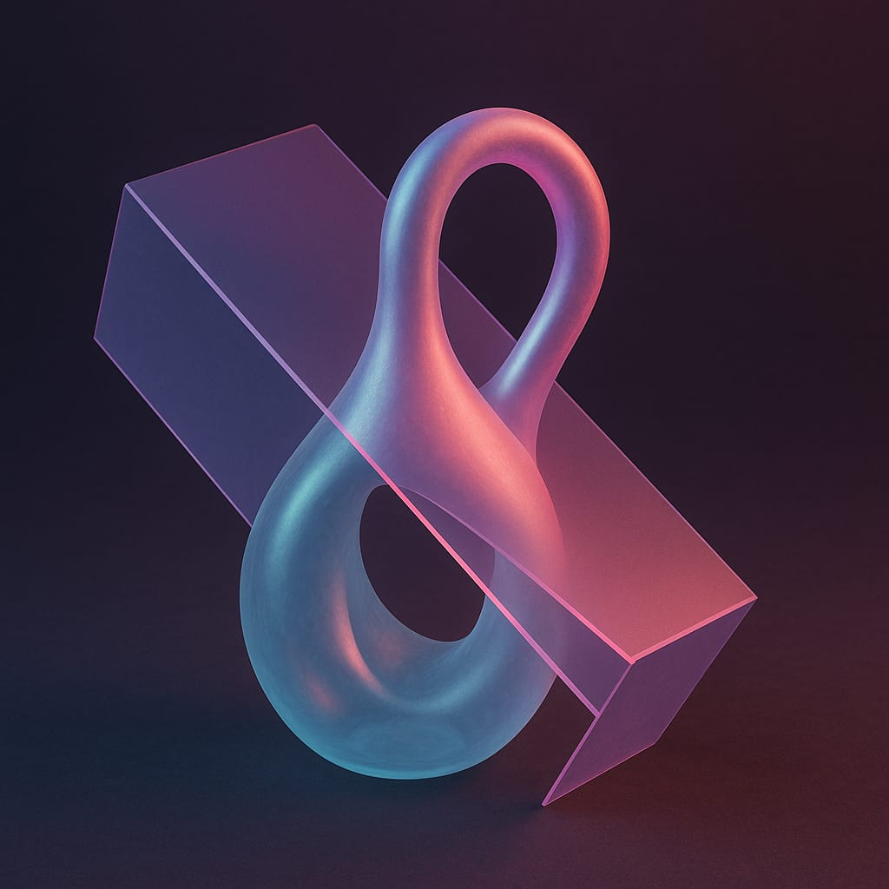 

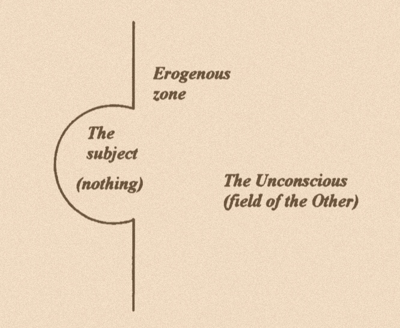 

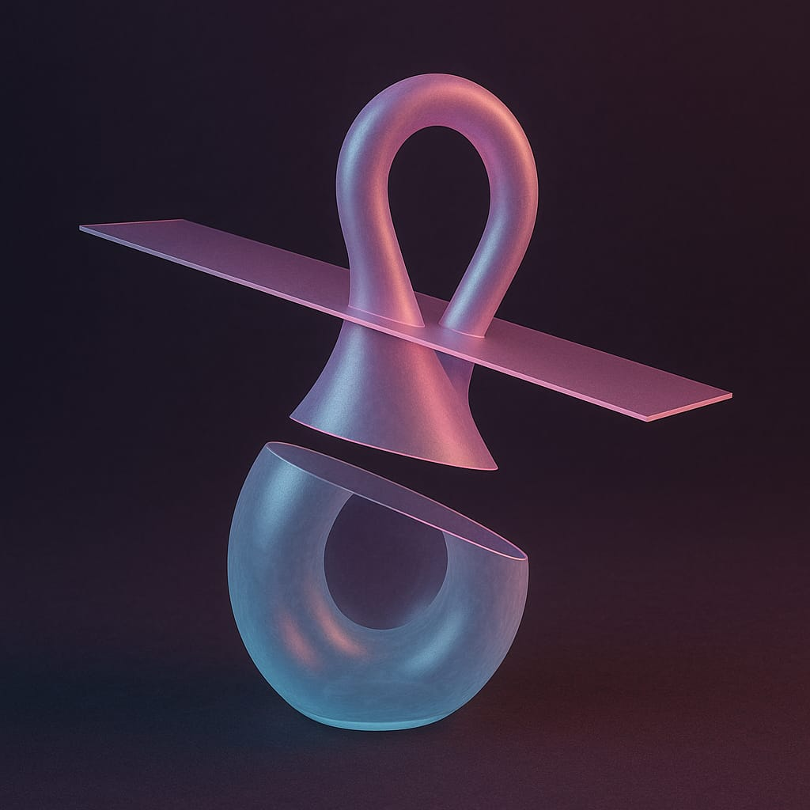 

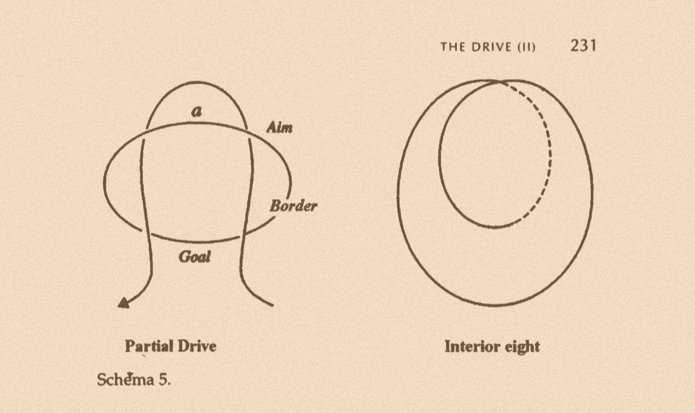 

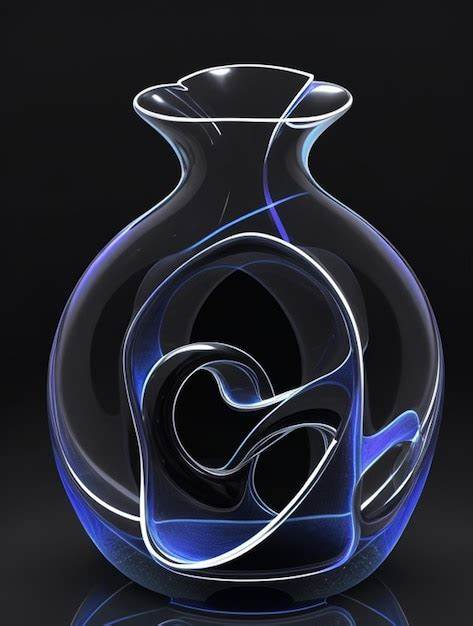 

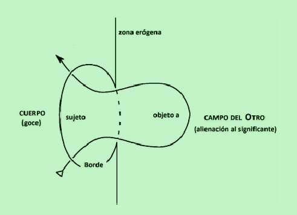 

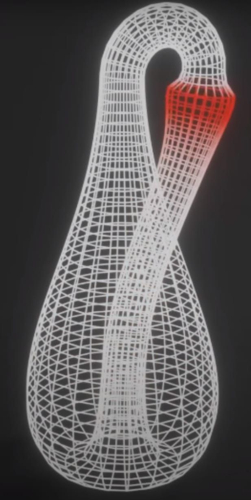 

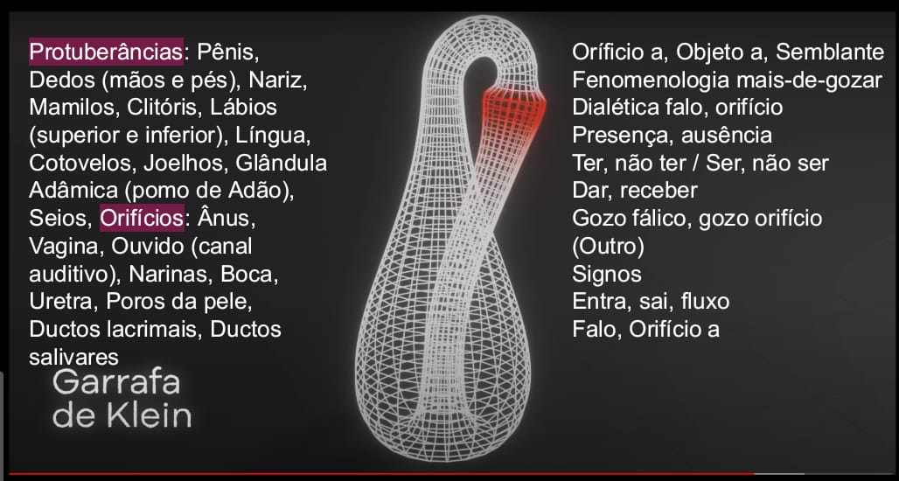 

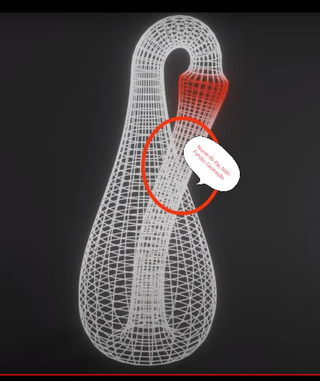

# Dunker
## Topology 
ref: https://www.youtube.com/watch?v=n5jEAvVqIEw&list=PLlHDVKUxuaFoOOthkZhBFnMmW4wjD6ZB8&index=8&ab_channel=ChristianDunker
### Pulsão: https://youtube.com/clip/UgkxpDRKxyLnjPxan8ZRI54AIhOuBhWbtQWV?si=wElZF4mTiRQkmjJz

<video controls src="../mp4/Topology/Pulsion.mp4" title="Pulsion"></video> 

### Toro-demanda

<video controls src="../mp4/Topology/Topology-Toro-Demanda.mp4" title="Topology-Toro-Demanda"></video> 

### Moebius

<video controls src="../mp4/Topology/Moebius.mp4" title="Moebius"></video> 

### Traço unário: 11:49:2 - 12:42:7

<video controls src="../mp4/Topology/Unar.mp4" title="Unar"></video>

### Identificação, Neurose: 13:57 - 15:34

<video controls src="../mp4/Topology/Identification-neurosis.mp4" title="Identification-neurosis"></video> 

### Identificações, objeto a: 16:26 - 18:51

<video controls src="../mp4/Topology/Identifications-objecta.mp4" title="Identifications-objecta"></video> 

### Cross-cap: 19:07 - 19:47
<video controls src="../mp4/Topology/Crosscap.mp4" title="Crosscap"></video>

### Garrafa de Klein: 19:47 - 20:22

<video controls src="../mp4/Topology/Klein.mp4" title="Klein"></video> 

## R, I
https://www.youtube.com/watch?v=e20JrzrCLOs&list=PLlHDVKUxuaFoOOthkZhBFnMmW4wjD6ZB8&index=1&ab_channel=ChristianDunker | Esquema R e Esquema I de Lacan | Christian Dunker | Falando nIsso 342 - YouTube

### Critic
<video controls src="../mp4/RI/Critic.mp4" title="Critic"></video>

### Forclusion
<video controls src="../mp4/RI/Forclusion.mp4" title="Forclusion"></video>

### Identity
<video controls src="../mp4/RI/Identity-Object.mp4" title="Identity-Object"></video>

### NdP
<video controls src="../mp4/RI/NdP.mp4" title="NdP"></video>

### Phantasm
<video controls src="../mp4/RI/Phantasm.mp4" title="Phantasm"></video>

### PsychosisPhenomena
<video controls src="../mp4/RI/PsychosisPhenomena.mp4" title="PsychosisPhenomena"></video>

### RealityLossNeurosis
<video controls src="../mp4/RI/R.mp4" title="Title"></video>

### RealityLossNeurosis
<video controls src="../mp4/RI/RealityLossNeurosis.mp4" title="RealityLossNeurosis"></video>

### SchreberPhenomena
<video controls src="../mp4/RI/SchreberPhenomena.mp4" title="SchreberPhenomena"></video>

### TransexualJouissance
<video controls src="../mp4/RI/TransexualJouissance.mp4" title="TransexualJouissance"></video>

## L
https://www.youtube.com/watch?v=mrs2-XO3OcA&list=PLlHDVKUxuaFoOOthkZhBFnMmW4wjD6ZB8&index=3&ab_channel=ChristianDunker | O esquema L de Lacan | Christian Dunker | Falando nIsso 263 - YouTube

## RSI Topology
https://www.youtube.com/watch?v=1i8XrMmWA4A&list=PLlHDVKUxuaFoOOthkZhBFnMmW4wjD6ZB8&index=5&ab_channel=ChristianDunker | A topologia dos nós borromeanos de Lacan | Christian Dunker | Falando nIsso 224 - YouTube

## Graph of desire
https://www.youtube.com/watch?v=xD_tg-bY1yM&list=PLlHDVKUxuaFoOOthkZhBFnMmW4wjD6ZB8&index=7&ab_channel=ChristianDunker | Grafo do desejo | Christian Dunker | Falando nIsso 133 - YouTube

## Sexuation
https://www.youtube.com/watch?v=N_GAiKm2Bcw&list=PLlHDVKUxuaFoOOthkZhBFnMmW4wjD6ZB8&index=8&ab_channel=ChristianDunker | As formas de sexuação | Christian Dunker | Falando nIsso 83 - YouTube

## Discourse Theory
https://www.youtube.com/watch?v=FAPE8-L8orE&list=PLlHDVKUxuaFoOOthkZhBFnMmW4wjD6ZB8&index=8 | Os 4 discursos de Lacan | Christian Dunker | Falando nIsso 82 - YouTube

# Topology Animations

<video controls src="../mp4/Pinterest/Elemental reality-Topology.mp4" title="Title"></video> 
<video controls src="../mp4/Pinterest/Elemental topology, proportions, mixture.mp4" title="Title"></video> 
<video controls src="../mp4/Pinterest/Evil Topology.mp4" title="Title"></video> 
<video controls src="../mp4/Pinterest/Melancholic Topology.mp4" title="Title"></video> 
<video controls src="../mp4/Pinterest/Não-Relação, Percurso nD com o Outro.mp4" title="Title"></video> 
<video controls src="../mp4/Pinterest/nD Transformation.mp4" title="Title"></video> 
<video controls src="../mp4/Pinterest/Sujeito nD-Outro nD.mp4" title="Title"></video> 
<video controls src="../mp4/Pinterest/Sujeito nD transformation.mp4" title="Title"></video> 
<video controls src="../mp4/Pinterest/Symbiosis.mp4" title="Title"></video> 
 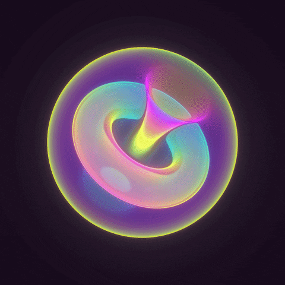 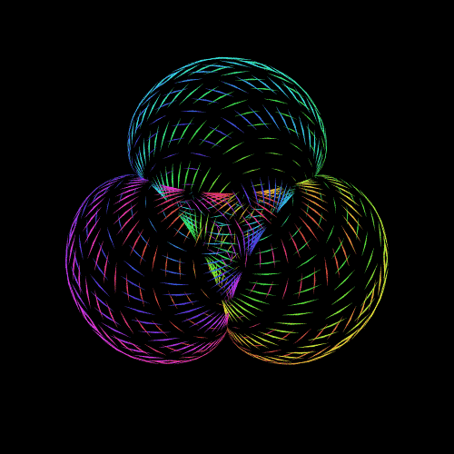