# Klein’s bottle Clinic

# Talles Barrini

# Discurso de Lacan, Herança Psicanalítica

Problemas cruciais da Psicanálise 1980

Lógica e cena de análise: Diagnóstico\, Interpretação\, Direção do tratamento\, Semiótica\, Estruturas do Parentesco

Diagnóstico: Neurose\, Psicoses\, Perversão\, Autismo\, Toxicomania\, Anorexia\, Esquizofrenia\, Paranóia

Cena de análise: inconsistente\, repetição\, pulsão\, transferência\. O analista e o analisante\. Laços sociais\. Teoria dos discursos

Grafo do desejo\, esquemas L\, R\, I\, RSI

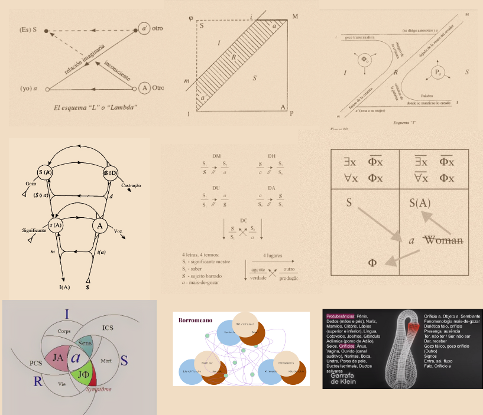

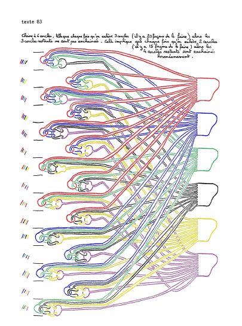

# Áreas de Trabalho

__Semiótica__  __ \- __ Sujeito e a fantasia: na Psicanálise\, na Psiquiatria\, na Arte\, na Literatura\, na Filosofia \- Espaço\-tempo\-fluxo de signosEquações \- Matemática\, Lógica\, Topologia \- Lógica e cena de análise: Diagnóstico\, Interpretação\, Direção do tratamento\, Semiótica\, Estruturas do Parentesco

Modelo Computacional \- Construção Computacional da Fantasia\, Algoritmos de Análise de Texto\, Criação de Imagens\, Vídeos\, Vozes\, Textos

__Bancar__  __: Financiar\, Sustentar\, Custear\, Arcar com\, Patrocinar\, __  __Prover__  __: Suprir\, Abastecer\, Equipar\, Suportar\, Dotar\, __  __Fornecer__  __: Distribuir\, Suprir\, Entregar\, Dispensar\, Disponibilizar__

__Desejar__  __: Almejar\, Ambicionar\, Ansiar\, Cobiçar\, Pretender\, __  __Querer__  __: Almejar\, Pretender\, Aspirar\, Ambicionar\, Desejar\, __  __Sonhar__  __: Fantasiar\, Imaginar\, Idealizar\, Projetar\, Vislumbrar__

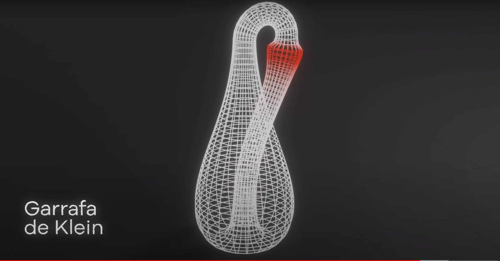

Protuberâncias: Pênis\, Dedos \(mãos e pés\)\, Nariz\, Mamilos\, Clitóris\, Lábios \(superior e inferior\)\, Língua\, Cotovelos\, Joelhos\, Glândula Adâmica \(pomo de Adão\)\, Seios\, Orifícios: Ânus\, Vagina\, Ouvido \(canal auditivo\)\, Narinas\, Boca\, Uretra\, Poros da pele\, Ductos lacrimais\, Ductos salivares

Oríficio a\, Objeto a\, Semblante

Fenomenologia mais\-de\-gozar

Dialética falo\, orifícioPresença\, ausênciaTer\, não ter / Ser\, não serDar\, receber

Gozo fálico\, gozo orifício \(Outro\)

Signos

Entra\, sai\, fluxoFalo\, Orifício a

__Função paterna__ : Pai como provedor de  pênis  para a mãe\, dinheiro\, fidelidade à família\, herança profissional\, Circulação social para os filhosBancar: Financiar\, Sustentar\, Custear\, Arcar com\, Patrocinar\, Prover: SuprirFazer e Gostar

Função materna: Mãe como receptora de pênis do pai\, dinheiro\, fidelidade à família\, cuidados dos filhos e casa\,  amizade com outras mulheresOríficio a\, Objeto a\, Semblante

Fenomenologia mais\-de\-gozar

Dialética falo\, orifícioPresença\, ausênciaTer\, não ter / Ser\, não ser\, Dar\, receber\, Gozo fálico\, gozo orifício \(Outro\)\, Signos

# Modernidade

Discurso do Artista\, empreendedorismo\, invenção e laço social

Efeitos da aviação\, Eletrônicos: Semiótica e estruturas do Parentesco: distância da família\, modernidade líquida\, entre signos familiares e estrangeiros

Efeitos da Internet/Computação: Encontros\, Amor\, Parentalidades e famílias LGBTQAIP\+\, Códigos da Psicanálise: formalização em código

# Klein’s bottle Clinic
Clínica da Fantasia

# Ilustrações

What does the 4D Klein Bottle look like ? \[4D Toys\]  _[https://www\.youtube\.com/watch?v=N\_4VaG7ZQE8&ab\_channel=%5Bmtbdesignworks%7BMiegakure%2C4DToys%7D%5D](https://www.youtube.com/watch?v=N_4VaG7ZQE8&ab_channel=%5Bmtbdesignworks%7BMiegakure%2C4DToys%7D%5D)_

Paradox of the Möbius Strip and Klein Bottle \- A 4D Visualization  _[https://www\.youtube\.com/watch?v=JmvHNatZgVI&ab\_channel=Andrew%27sCampfire](https://www.youtube.com/watch?v=JmvHNatZgVI&ab_channel=Andrew%27sCampfire)_

The Adventures of the Klein Bottle   _[https://www\.youtube\.com/watch?v=sRTKSzAOBr4&t=80s&ab\_channel=mathemamovies](https://www.youtube.com/watch?v=sRTKSzAOBr4&t=80s&ab_channel=mathemamovies)_

# Klein’s bottle modelling

* Software para recriar a Garrafa de Klein do vídeo do Dunker: cortar a garrafa\, duplicar\, move suas partes\, colorir\, deformar\, rotacionar\, ondular\. Software 3D: Blender ou outro
* Aplicar texturas diferentes na garrafa\, separar alça\, buraco\, centro\, produzir leve protuberância vermelha como na garrafa do Dunker
* Aplicar sombra/cobertura sobre a garrafa\, textura com escritos chineses\, estofado: recobrimento com a fantasia
* Animação: aumentar/diminuir proporções da garrafa: alça\, buraco\, centro
  * movimento de onda pela garrafa
  * interação entre duas garrafas\, interação entre três garrafas\, interação entre várias garrafas
  * com o estofado da garrafa\, diferentes fantasias\, crise de gozo\, furos na fantasia

# Ontologia, Fenomenologia da fantasia

Renderização da fantasia

O sujeito\, a alienação\, Sujeito \- Outro

Seu corpo\, ideias\, Signos

Mais\-de\-gozar\, Causa do desejo

Repetição\, Inconsciente\, Pulsão\, Transferência

Angustia\, modalidades de gozo\, Furos

Demanda de Gozo

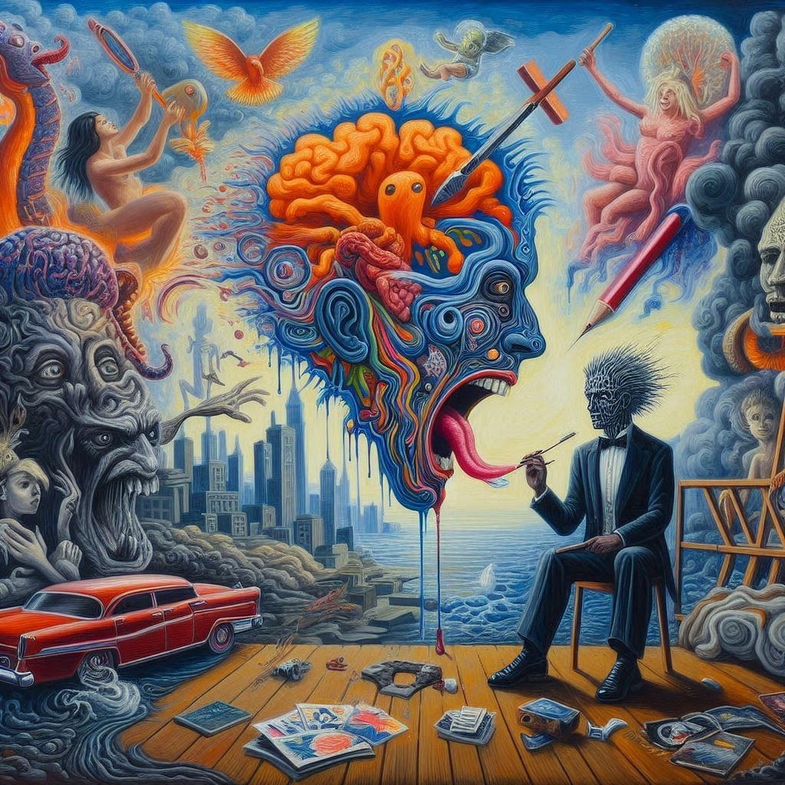

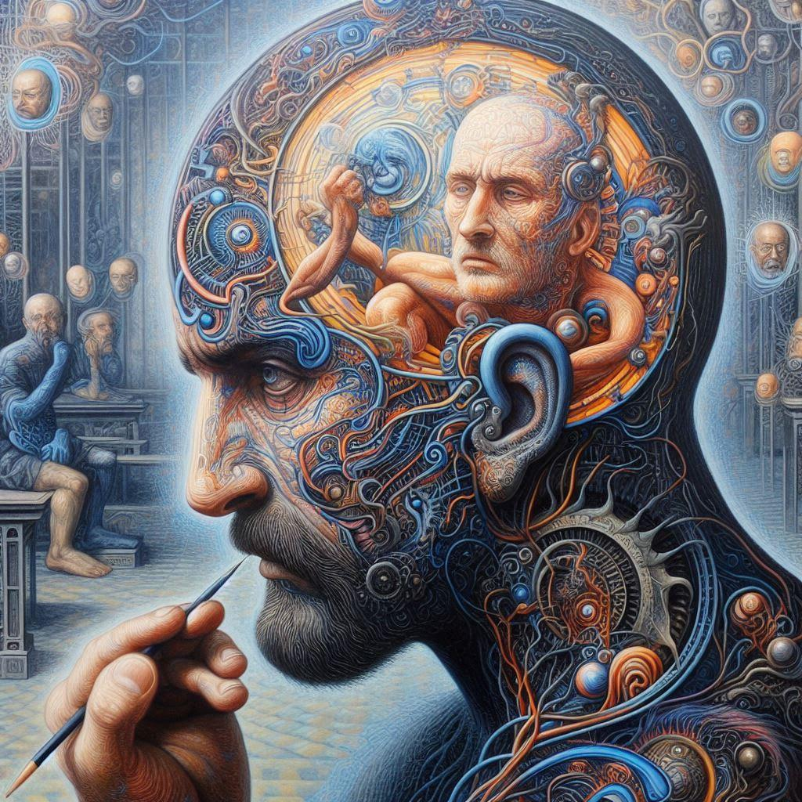

# Relações Precárias, Não há relação

Precariedade\, solidão\, mal\-entendidos

Amórdio

Repetição\, Inconsciente\, Fantasia\, Gozo

Onipotência/Grandezas/Grandes Ideais/Megalomania x Dejeto/Desamparo/Vulnerabilidade/Zero/Dívidas/Merda/Nada

Renuncia\, esperança frente à Fantasia

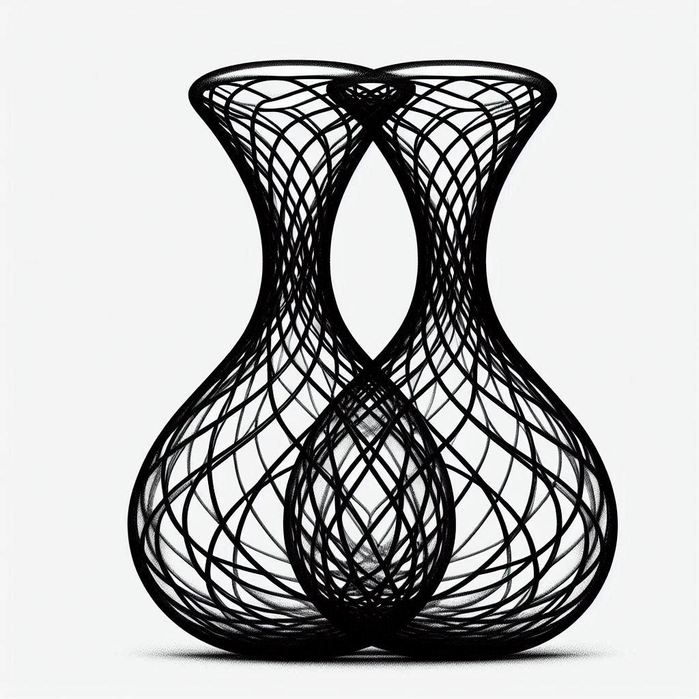

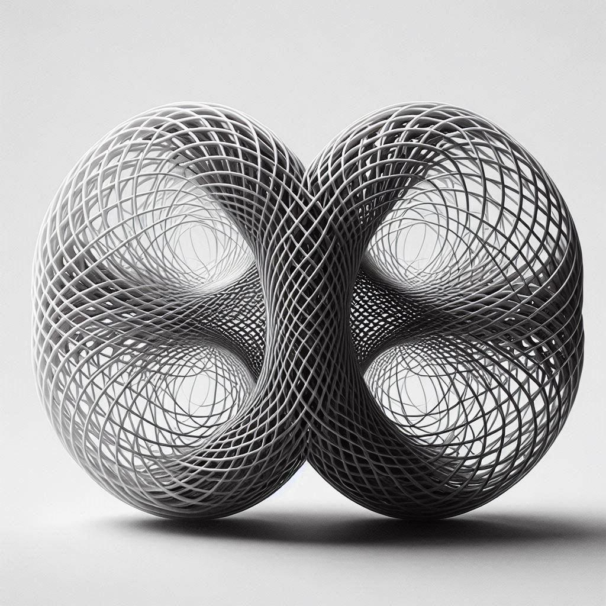

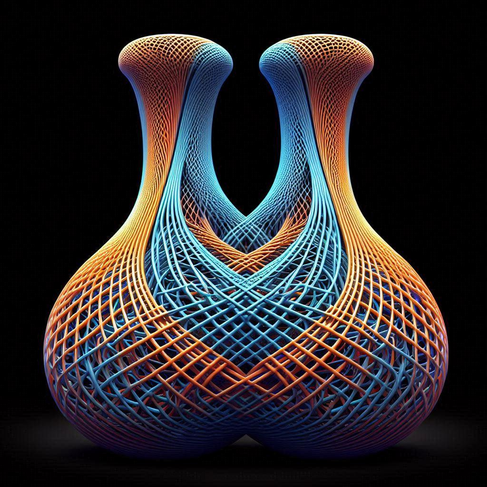

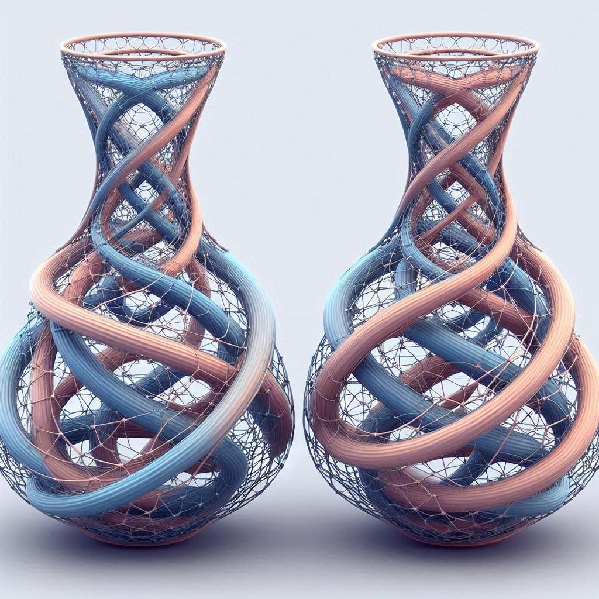

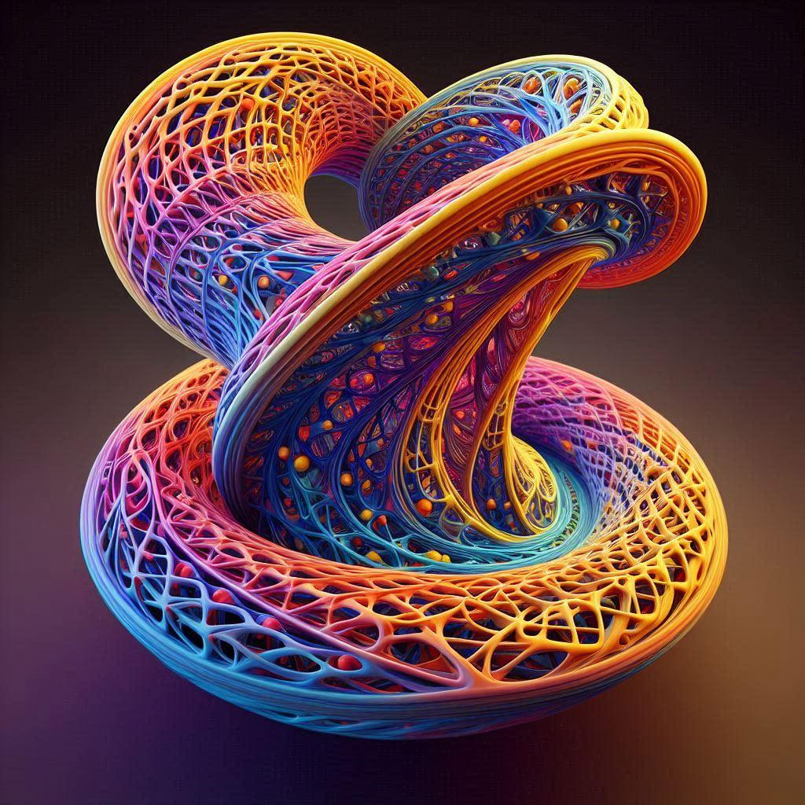

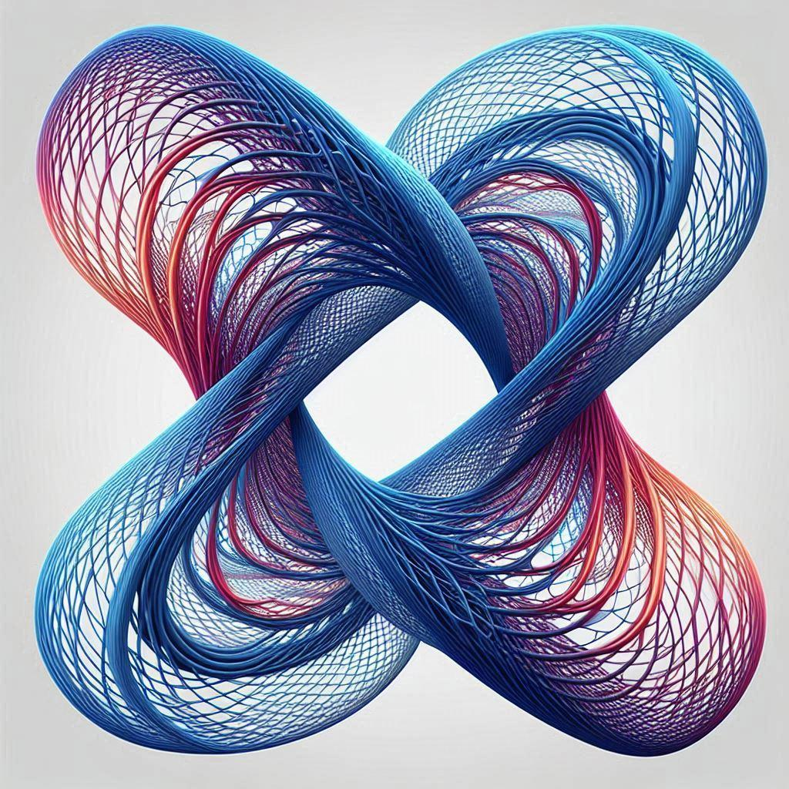

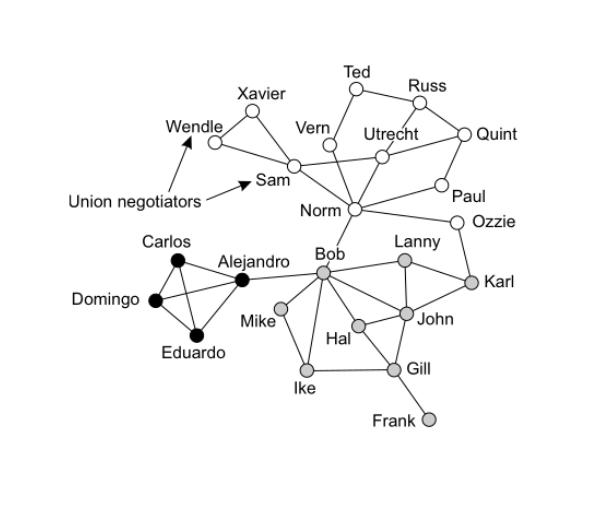

# Crise de Gozo, Furos na Fantasia

Mal\-estar na civilização

Mal\-estar no Sujeito

Melancolia\, Angústia\, Desorientação\, Perda de Sentido

Desencontros

Eu/Outro é insuportável

# Renderização da fantasia

Pinturas\, Costuras\, Bordados

\# Reconfiguração do campo de conexões\, Espaço\-tempo\-investimento\. Reavaliar arestas e pesos\, fazer outras conexões\, reorganizar calendário\, avaliação de mais\-de\-gozar de fluxos no espaço\-tempo

Cores\, texturas\, espaço\-tempo

Signos\, Escritos\, Resolução da fantasia

Tratamento do real pelo real no qual se deposita um gozo que é transformado até se tornar “estético”\, como se diz\, enquanto o objeto produzido impõe\-se ao real\. Há outros tipos de solução que não usam o simbólico\, mas procedem a uma operação real sobre o real do gozo não aprisionado na rede da linguagem\. Assim é a obra — pictórica\, por exemplo —\, quando ela não joga com o verbo\, mas parteja ex nihilo um objeto novo\, sem precedentes \.

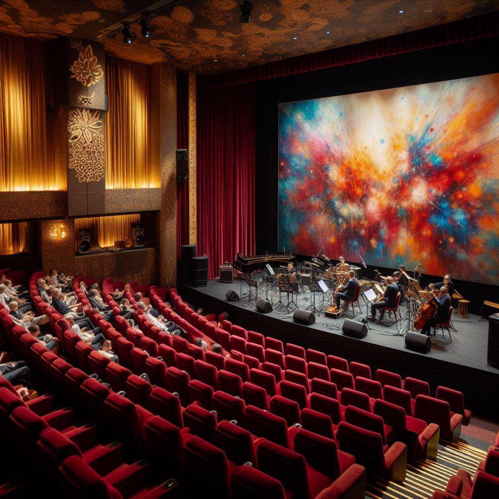

# Representação de conceitos com a Garrafa de Klein

Partes da garrafa: Falo\, Buraco\, Virada do falo ao buraco\, Fluxo na superfície\, textura/coloração/escritos = fantasia\, estofado

Movimentos = abertura e fechamento do buraco\, dilatação do falo\, reconfiguração da garrafa\, partes\, cores

Nome\-do\-Pai: Virada do falo ao buraco \- costura que distancia o gozo fálico do gozo Outro: F\(x\)\, G\(\-x\)\, xMais\-de\-gozar

Crise de gozo = crise de fluxoMelancolia = desbotado da fantasia\, do estofadoDelírio = tentativa de recobrir os furos na fantasiaMedicina = operação no corpo através de cortes e medicamentosObsessivo = buraco mínimo\, falo protuberante\, falo sensível Histérica = gozo na falta\, buraco sensívelTransexualidade = alteração na coloração\, protuberâncias da garrafaPerversão = gozo na transgressão da fantasia social\, costumes\, consentimento\, Kant/Sade\, não orientabilidade da superfície\-leiMigração = Consumo/Produção de signos estrangeiros\, mais\, fluxo de outrosToxicomania = objetos que excitam a garrafa

# Animação da fantasia

* Composição
  * Corte da garrafa\, duplicar\, move suas partes\, colorir\, deformar\, rotacionar\, ondular\. Software 3D: Blender ou outro
  * Aplicar texturas diferentes na garrafa\, separar alça\, buraco\, centro\, produzir leve protuberância vermelha como na garrafa do Dunker
  * Aplicar sombra/cobertura sobre a garrafa\, textura com escritos chineses\, estofado: recobrimento com a fantasia
* Animação
  * aumentar/diminuir proporções da garrafa: alça\, buraco\, centro
  * movimento de onda pela garrafa
  * interação entre duas garrafas\, interação entre três garrafas\, interação entre várias garrafas
  * com o estofado da garrafa\, diferentes fantasias\, crise de gozo\, furos na fantasia

_[https://www\.youtube\.com/watch?v=3JmEF1AdyXo&ab\_channel=TheAdam | Created With Blender I Timelapse \- YouTube](https://www.youtube.com/watch?v=3JmEF1AdyXo&ab_channel=TheAdam)_

_[https://www\.youtube\.com/watch?v=33KrPbStjcc&ab\_channel=sketchinginblender | Guardian At The Gate | ](https://www.youtube.com/watch?v=33KrPbStjcc&ab_channel=sketchinginblender)_  _[Concept Art](https://www.youtube.com/watch?v=33KrPbStjcc&ab_channel=sketchinginblender)_  _[ | Blender 4\.0 \- YouTube](https://www.youtube.com/watch?v=33KrPbStjcc&ab_channel=sketchinginblender)_

_[https://www\.youtube\.com/watch?v=tCTkkHGRpNk&ab\_channel=tinynocky | I animated this in 18 days\.\.\. in Blender \- YouTube](https://www.youtube.com/watch?v=tCTkkHGRpNk&ab_channel=tinynocky)_

_[https://www\.youtube\.com/watch?v=WhWc3b3KhnY | Spring \- Blender Open Movie \- YouTube](https://www.youtube.com/watch?v=WhWc3b3KhnY)_

# Gêneros na fantasia

* Composição
  * Comédia\, Tragédia\, Horror\, Erótica\, Melancolia\, Paranóia\, Esquizofrenia\, Pesadelos
  * Estrutura do teatro: Cenas\, Personagens\, Arcos
* Animação
  * Pesadelos
  * movimento de onda pela garrafa

__Costura com a função paterna/materna: parecer\, fazer\, gostar__  __\(RSI\)__

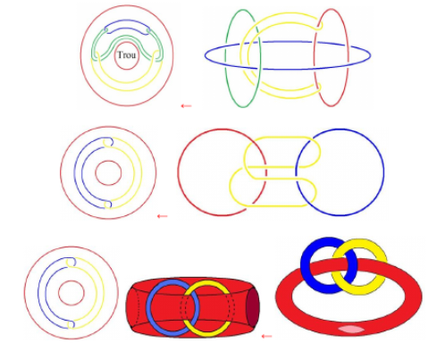

__Suplências/Renderização da fantasia__  __ com discursos: DU\, DM\, DH\, DA\, DC\, __  __Discurso do Artista__  __ __

# Encontro entre analista e analisante, Cena analítica

Encontros de Mais\-de\-gozar\, encontros de campos de Klein\, Fluxos de mais\-de\-gozarFantasia do Analista na cena de Análise\, mais\-de\-gozar nesta cena: Escuta\, interpretação\, direção do tratamento\, discurso do artistaDireção do tratamento se inicia e se encerra a cada sessão: Desejo\, demanda de gozo\, Campo de fantasia que demanda gozo\, Campo de Klein \(inconsciente\) que demanda gozoInterpretação: Campo de Klein do Analista: Tenho algo a dizer\! Corte de sessão: Campo de Klein do Analista: BastaSeparação Analista e Analisante: Mudança de cena: Mais\-de\-gozar em outro lugar/posição/Discursos/Campos de Linguagens/Laços SociaisCaminhar a céu aberto

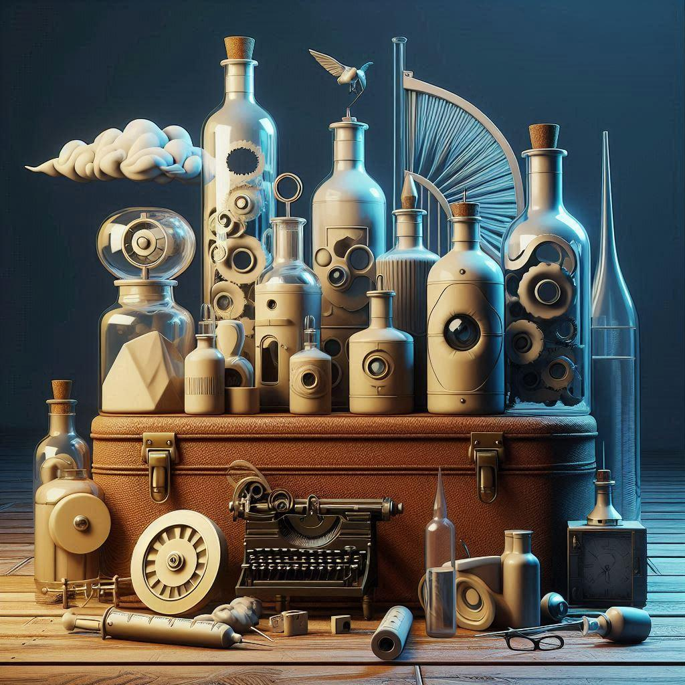

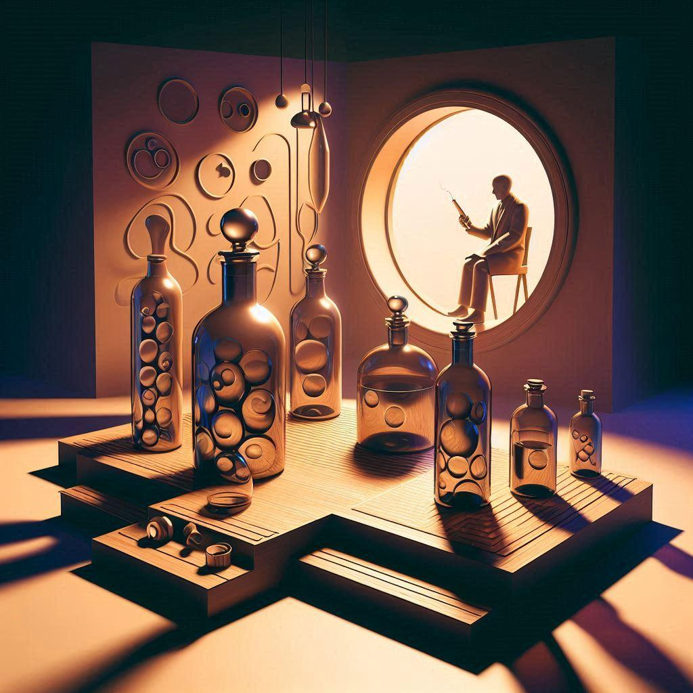

# Laços Sociais: espaço-tempo de fluxo de gozo

Um mundo de garrafas de Klein com suas fantasias\, texturas\, dimensões particulares\, poderes precários\, com demandas\, desejos\, sinthomas\, em movimento

O sujeito e suas apostas\, sem o conhecimento global\, sem garantias\, sem oráculos

Caminhando a céu aberto

# Klein’s bottle Clinic
Algoritmos físico-matemáticos

# Algoritmos

Grafos\, Imagens\, Esquemas da Psicanálise

Modelos Matemáticos

IAs

# Pseudocódigo de uma Análise

Start

Do

While

End

Evaluate

\- Buracos e protuberâncias: física dos buracos\, do universo\, física das partículas\, fluxo por buracos: lei da Gauss\, efeito da matéria na geometria\, Black hole quantum mechanics\, More General Black Holes\, The Black Hole Zoo\, Killing Horizons\, Charged \(Reissner\-Nordstrom\) Black Holes\, Rotating \(Kerr\) Black Holes\, The Penrose Process and Black\-Hole Thermodynamics\, Quantum mechanics and the square well\, String thermodynamics and black holes\, Counting states of a black hole

__Tipos de enlaçamento com o outro: laço social__

__Éléments pour une théorie psychanalytique du lien__

\- Laços: Idealized Wave\-Dominated Detector\, Excited by Steady Flux of Monochromatic Waves\, Solar\-System Experiments\, Closed and unoriented strings\, Strings in curved spacetime\, The no\-ghost theorem\, Open and unoriented one\-loop graphs\, Compactification of several dimensions\, Sewing and cutting CFTs\, Low dimensions and noncritical strings\, Superspace and superfields\, Strings at strong coupling\, Orbifolds of the heterotic string\, Supersymmetry breaking in perturbation theory\, Relativistic strings\, Tension and energy of a stretched string\, Motion of open string endpoints\, Cosmic strings\, T\-duality of closed strings\, Partitions and the quantum violin string

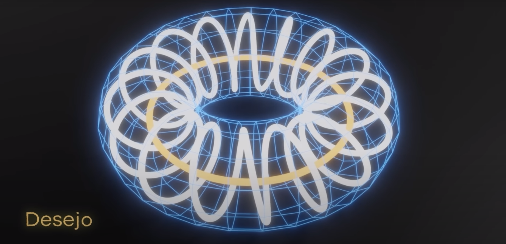

Toro do desejo\, Toro da demanda

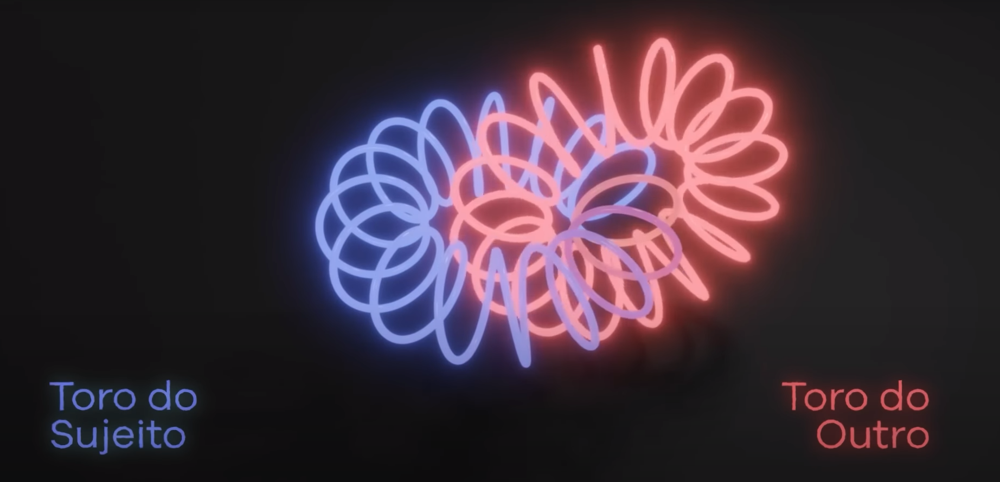

# Transmitir el deseo a través de un signo… de la comunicación. 
Lacan chama esses dois toros de "toro do sujeito" e "toro do outro". O que define a neurose? A identificação. A identificação daquilo que é desejo no toro do sujeito com a demanda no toro do outro, e do que é demanda no toro do sujeito com o desejo no toro do outro. Ou seja, há uma identificação, uma forma ativa entre o sujeito e o outro, que pode ser demonstrada topologicamente. Ela não é só uma intuição; é uma inferência topológica.

\- Bordas\, Lei\, Fronteiras: Reflections\, Rotations\, and the Combination of Rotations\, Spin Space and Its Basis Spinors\, The Choice of Edge Lengths\, Space\, Superspace\, and Spacetime Distinguished\, Fluctuations in Geometry\, Perturbation Theory and Gravitational Radiation\, Degrees of Freedom\, Quantum Field Theory in Curved Spacetime\, Special relativity and extra dimensions\, Constructing the state space

\- Migração: Global Techniques\, Horizons\, and Singularity Theorems\, Global Techniques Versus Local Techniques\, Mudança de Campo\, variáveis\, Espaço\-tempo\, pátria\, língua materna\, fluxos\, laços

\- Gozo: GRAVITATIONAL WAVES\, Propagation\, Stress\-Energy Tensor for Gravitational Waves

\- Física Melancolia: Collapse of a Star with Uniform Density and Zero Pressure\, The Fate of a Man Who Falls into the Singularity at r == 0\, Gravitational Collapse\, Mass\, Angular Momentum\, Charge\, and Magnetic\, Gravitational Collapse as the Greatest Crisis in Physics of All Time\, The Black Box: The Reprocessing of the Universe

\- Paranóia: Is the Gravitational Constant Constant?\, World\-sheet currents

Normal: Renormalization of Feynman Diagrams

\-Perturbative expansion of a two\-point correlation function \- The 3\-theory

\-Perturbative expansion of Feynman integrals

Computation of a Feynman integral over functions on a Minkowski space

\-Renormalization of divergent graphs

\-Renormalization in higher orders

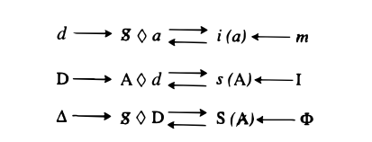

__d: desejo\, D: demanda\, A: Outro suposto completo__  __$: Falta estrutural\, significado do Outro\, S: Significante da falta no Outro__  __a: oríficio a\, borda\, causa do desejo\, dejeto__

__Semblantes: i\(a\): imagem do outro\, m: própria imagem\, Ideal do Eu__  __Delta: Eu suposto completo\, Phi: falo __

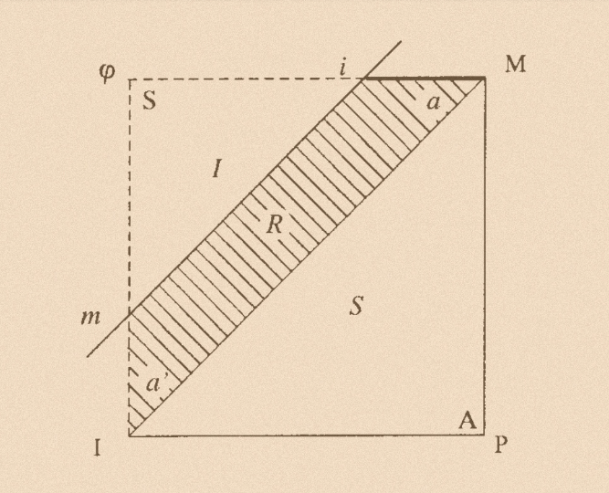

__Esquema da Comunicação__

__Esquema da perda da realidade na neurose e na psicose__

__O que é a realidade\, vozes\, sentidos\, matéria\, espaço\-tempo\, separação\, não binariedade das partículas: onda/matéria\, teoria da relatividade\, teoria das cordas: teoria dos laços__

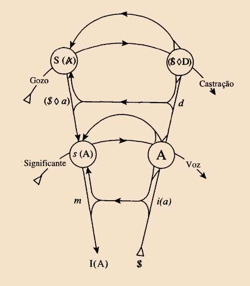

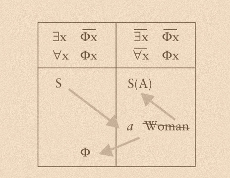

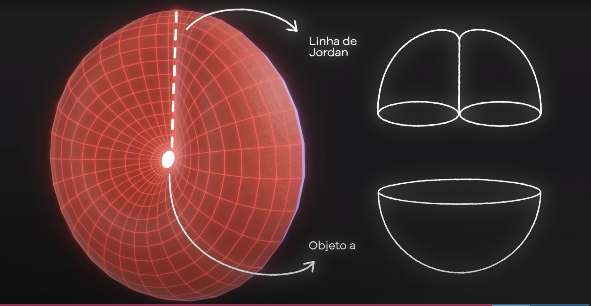

# Gozo

2\) A mesma solução\, que consiste em cobrir a coisa com uma ficção apensa a um significante ideal\, funciona em muitos casos\, mas não exige forçosamente a inventividade delirante do sujeito\.

3\) Civilizar a coisa pelo simbólico é também a via de algumas sublimações criacionistas\. A promoção do pai é uma delas\, aliás\, como dizia Lacan em seu seminário sobre a ética\.\.\. Assim\, é concebível que essas sublimações sejam particularmente convocadas na psicose\, como provam tantos nomes conhecidos: Joyce\, Hölderlin\, Nerval\, Rousseau\, Van Gogh etc\. Nem todas as sublimações são do mesmo tipo\, mas as que provêm da construção de um novo simbólico têm uma função homogênea ao que é o delírio para Schreber\.   Nome civil

# Mais-de-gozar

Apostas na interpretação do sintoma: Trans\-formação dos signosTrans\-formação do corpoInterpretação criativa pela arteEscrita\, poesia\, músicaAmorMítico

# Unheimlich

# Borromeano

# RSI

# Desejo, a, Falo

Satisfação Parcial

Não participar

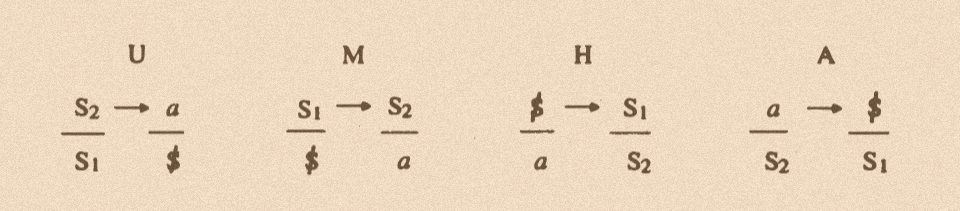

